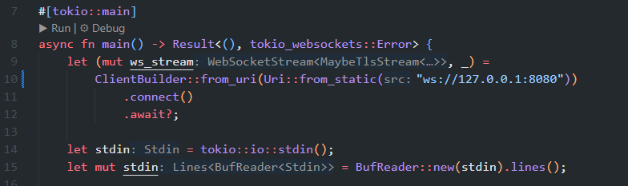

## Experiment 2.1: Original code of broadcast chat

### `server.rs`:
  
The continuous loop in `server.rs` handles both incoming and outgoing messages. The first task in the loop, `Some(msg)`, receives incoming messages from connected clients, then broadcasts the messages to all connected clients. The second task in the loop, `Ok(msg)`, broadcasts the outgoing message by the client to themselves.

### `client.rs`:
  
The continuous loop in `client.rs` handles both user input and server messages. The first task in the loop, `line`, take the user input and sends the message to the server. The second task in the loop, `msg`, receives incoming messages from the server and display them to the user.

### What happens when user types some texts in the client? 
As explained in the previous explanation on how the `server.rs` and `client.rs` work, when a user types some texts in a connected client, the input text will be sent to the server and the server will broadcast the input text to all connected clients including the client where the input text came from. Every connected clients will receive this message broadcasted by the server and will display the message to the user.

For example, in the picture above, firstly in the first client terminal (second from left most terminal) the user typed `"this is client 1 typing"` and so that exact text is broadcasted and displayed to all clients, including the first client terminal, which is why there are two texts of `"this is client 1 typing"` in the first client terminal, first one being the input typed by the user and the second one being the message broadcasted by the server and displayed by the client to the user.

## Experiment 2.2: Modifying Websocket Port

### Original `server.rs`:

### Modified `server.rs`:

### Original `client.rs`:

### Modified `client.rs`:

The websocket connection between client and server requires both ends to use matching port numbers for successful communication. In the original code, the connection was established on port 2000, while the modified version now uses port 8080. This change needed to be made in two critical locations to maintain proper functionality. First, in the `client.rs` file, the connection URI was updated to `ws://127.0.0.1:8080` where the ClientBuilder specifies the websocket endpoint. Second, in server.rs, the TcpListener was modified to bind to `127.0.0.1:8080` to ensure it listens on the same port that clients are attempting to connect to. The websocket protocol (ws://) remains consistent between both files as it's the standard protocol for unencrypted websocket connections. This modification demonstrates how the port number serves as a coordination point between client and server implementations, where both must agree on the same port number to establish successful communication while the protocol (ws://) defines the communication method. The `Cargo.toml` dependencies remained unchanged as they provide the underlying websocket functionality regardless of the specific port being used.

## Experiment 2.3: Adding Client Identification

### `server.rs` before client identification:

### `server.rs` after client identification:

The modification enhances the chat system by adding client identification using IP addresses and port numbers. In the server implementation, I made two key changes to achieve this. First, I added a welcome message that gets sent immediately when a client connects, which helps users understand they've successfully joined the chat. Second, I modified the message broadcasting format to include the sender's SocketAddr (IP:port) before each message.

The server now formats messages as "IP:PORT: MESSAGE" before broadcasting them to all clients. This provides valuable context about who sent each message, which is particularly important in a multi-client environment. The server also logs these messages with the same format to its console, helping with debugging and monitoring.

The client code didn't need modification because it simply displays whatever messages it receives from the server. Since the server now sends formatted messages including the sender information, clients automatically show this extra context. This demonstrates how the server can enrich messages before broadcasting them to all connected clients.

The implementation uses Rust's standard SocketAddr type which automatically provides both IP and port information. This solution provides basic identification while maintaining the simplicity of the original code, serving as a foundation for more advanced features like usernames or authentication in future iterations.